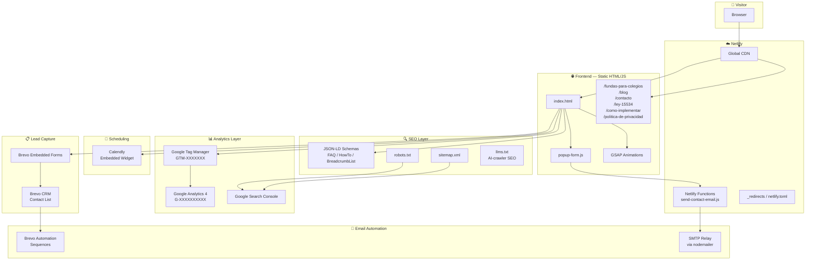
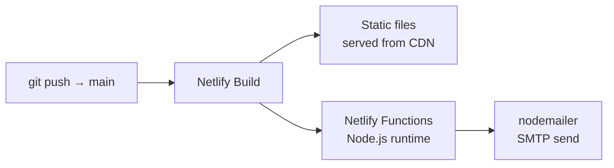
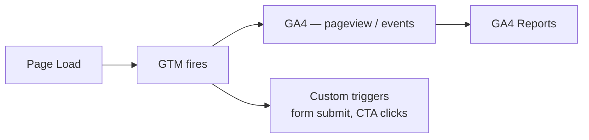
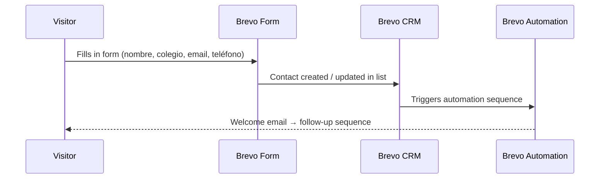
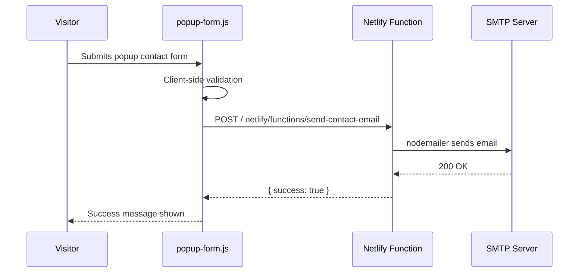
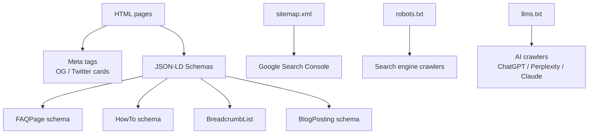

# NOUFON — Architecture

This document describes the full technical architecture of the NOUFON website: a static HTML/JS site deployed on Netlify with serverless backend functions and third-party integrations for analytics, lead capture, email automation, and scheduling.

---

## High-Level Overview



---

## Frontend Layer

The site is a **plain HTML/CSS/JavaScript** multi-page application. There is no build step or bundler — files are served directly from the repo root.

| File | Description |
|------|-------------|
| `index.html` | Home page — hero, value proposition, Brevo form, Calendly CTA |
| `fundas-para-colegios.html` | Product detail page |
| `blog.html` | Blog index |
| `como-implementar-politica-de-celulares-en-escuela.html` | Blog article |
| `ley-15534-celulares-escuela.html` | Legal information page |
| `contacto.html` | Contact form page |
| `politica-de-privacidad.html` | Privacy policy |
| `404.html` | Custom error page |
| `popup-form.js` | Handles popup contact form submission, validation, and POST to Netlify Function |

### Animations

[GSAP](https://gsap.com) is loaded from CDN and used for scroll-triggered entrance animations and interactive UI elements.

---

## Netlify Deployment



| Config | Value |
|--------|-------|
| Publish directory | `.` (repo root) |
| Build command | _(none — static site)_ |
| Functions directory | `netlify/functions/` |
| Pretty URLs | Enabled |

**Security headers** set globally via `netlify.toml`:
- `X-Frame-Options: SAMEORIGIN`
- `X-Content-Type-Options: nosniff`
- `Referrer-Policy: strict-origin-when-cross-origin`
- `Permissions-Policy: camera=(), microphone=(), geolocation=()`

---

## Analytics Layer



All analytics are orchestrated through **Google Tag Manager** to keep tracking logic out of the HTML source. GTM manages:
- GA4 pageview and event tracking
- Conversion events (form submissions, Calendly bookings)
- Custom trigger rules

---

## Lead Capture & Email Automation



Forms are embedded via **Brevo's hosted form widget**. On submission:
1. The contact is added to the designated Brevo list
2. A Brevo Automation sequence fires (welcome email + nurture follow-ups)

---

## Contact Form → Serverless Email



The Netlify Function reads SMTP credentials from **Netlify Environment Variables** (never from committed files).

---

## Scheduling

A **Calendly** embed is placed on the home page and product page as the primary call-to-action for school decision-makers to book a demo call.

---

## SEO Architecture



| Asset | Purpose |
|-------|---------|
| `sitemap.xml` | Submitted to Google Search Console for indexing |
| `robots.txt` | Explicit allow/disallow rules for crawlers + AI bots |
| `llms.txt` | AI-crawler-friendly summary of site content |
| JSON-LD schemas | Rich results eligibility (FAQ, HowTo, BreadcrumbList, BlogPosting) |

---

## Environment Variables

All secrets are stored in **Netlify's dashboard** (never committed). See [`.env.example`](.env.example) for the full list of required variables.

| Variable | Used By |
|----------|---------|
| `SMTP_HOST / SMTP_PORT / SMTP_USER / SMTP_PASS` | `send-contact-email.js` (nodemailer) |
| `CONTACT_EMAIL_TO` | Notification destination |
| `BREVO_API_KEY` | Brevo server-side calls |
| `GTM_CONTAINER_ID` | Google Tag Manager container |
| `GA4_MEASUREMENT_ID` | GA4 data stream |
| `CALENDLY_URL` | Calendly embed link |

---

## Repository Structure

```
noufon-website-2026/
├── netlify/
│   └── functions/
│       └── send-contact-email.js   # Serverless email handler
├── .agents/
│   └── skills/                     # Cowork AI skills
├── index.html                      # Home page
├── fundas-para-colegios.html       # Product page
├── blog.html                       # Blog index
├── como-implementar-...html        # Blog article
├── ley-15534-celulares-...html     # Legal info page
├── contacto.html                   # Contact page
├── politica-de-privacidad.html     # Privacy policy
├── 404.html                        # Error page
├── popup-form.js                   # Contact form logic
├── netlify.toml                    # Netlify config + security headers
├── _redirects                      # URL redirect rules
├── package.json                    # Node deps (nodemailer)
├── sitemap.xml                     # XML sitemap
├── robots.txt                      # Crawler rules
├── llms.txt                        # AI SEO
├── .env.example                    # Environment variable reference
└── CLAUDE.md                       # AI assistant context
```
